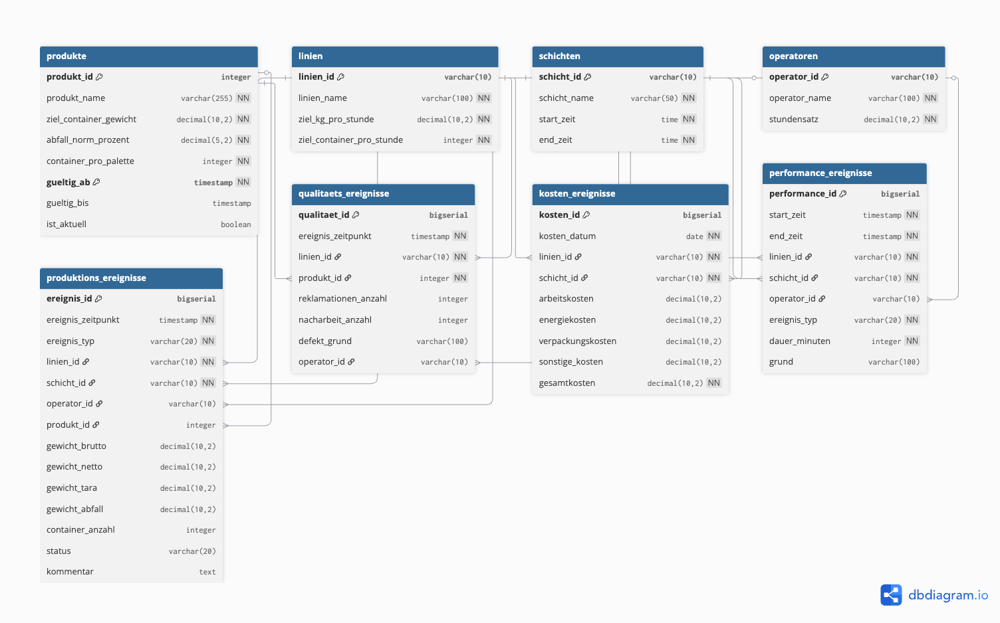
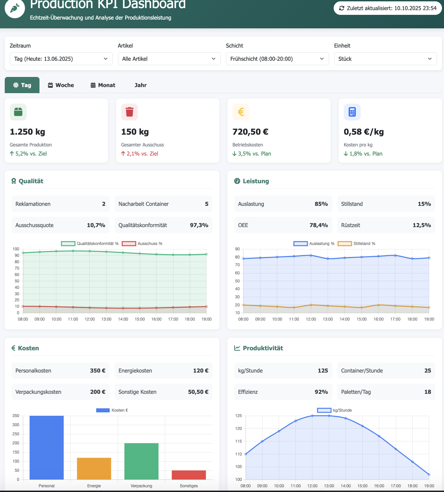
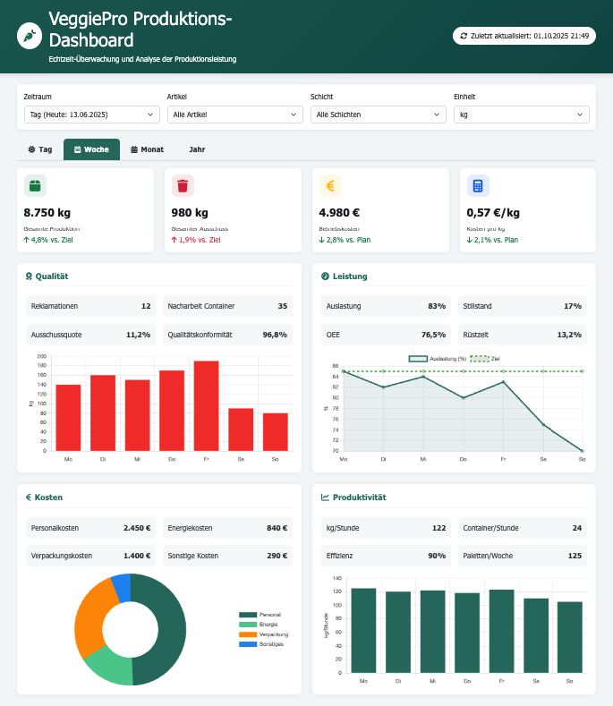
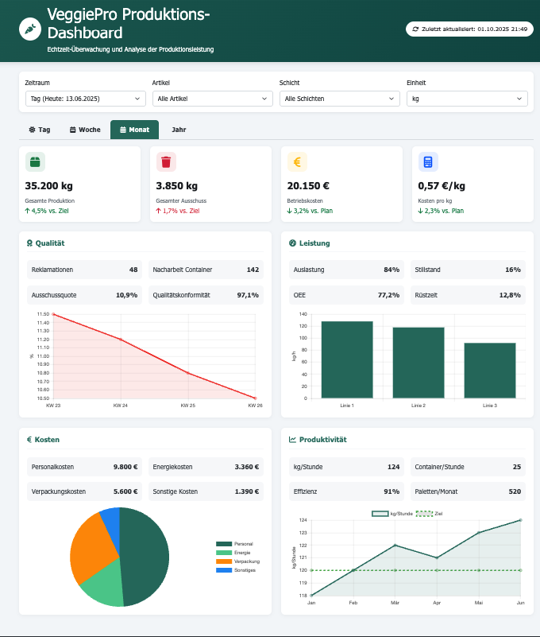
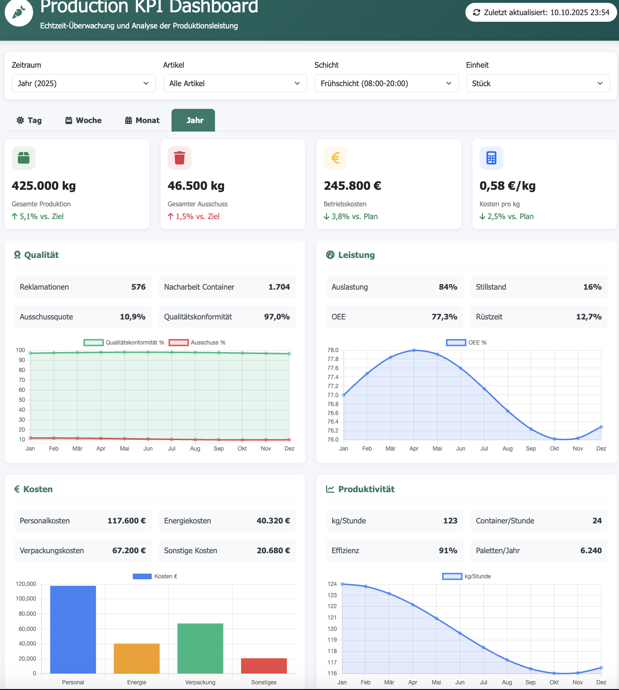

# Agricultural Production KPI Analytics System 🌱

<div align="center">


[](https://github.com/Kovalivska/agricultural-production-kpi-analytics)
[](https://datacoffee.de)

**Intelligente KPI-Analytik für die Gemüseverarbeitung | 40+ KPIs |  Produktionsreif**

[ Dokumentation](#-inhaltsverzeichnis) • [ Quick Start](#-erste-schritte) • [ Dashboards](#4-dashboard-prototypen-) • [ Lizenz](LICENSE)

</div>

---

##  Inhaltsverzeichnis

<details>
<summary><strong>🔍 Klicken Sie hier um das vollständige Inhaltsverzeichnis zu öffnen</strong></summary>

- [🎯 Projektübersicht](#-projektübersicht)
- [🏆 Hauptergebnisse des Projekts](#-hauptergebnisse-des-projekts)
  - [📊 KPI-System und Pyramidenstruktur](#1-kpi-system-und-pyramidenstruktur-)
  - [🐍 Python & SQL Implementation](#2-python--sql-implementation-)
  - [🏗️ Datenbankarchitektur](#3-datenbankarchitektur-️)
  - [📈 Dashboard-Prototypen](#4-dashboard-prototypen-)
- [🚀 Nächste Entwicklungsschritte](#-nächste-entwicklungsschritte)
  - [Phase 2: Data Pipeline Integration](#phase-2-data-pipeline-integration)
  - [Phase 3: Grafana & InfluxDB Integration](#phase-3-grafana--influxdb-integration)
  - [Phase 4: Produktions-Deployment](#phase-4-produktions-deployment)
- [💼 Geschäftswert und Skalierbarkeit](#-geschäftswert-und-skalierbarkeit)
  - [💰 ROI für Gemüseverarbeitungsbetriebe](#unmittelbarer-roi-für-gemüseverarbeitungsbetriebe)
  - [🏭 Skalierbarkeit für die Branche](#skalierbarkeit-für-die-branche)
  - [🎯 Marktpotenzial](#marktpotenzial)
- [🔬 Technische Innovationen](#-technische-innovationen)
- [🌱 Anwendungsszenarien](#-anwendungsszenarien)
- [🎓 Wissenschaftliche Beiträge](#-wissenschaftliche-beiträge)
- [📈 Projektmetriken und Erfolg](#-projektmetriken-und-erfolg)
- [📊 Projektstruktur](#-projektstruktur)
- [🔍 Methodische Innovationen](#-methodische-innovationen)
- [🎯 Demonstrierte Kompetenzen](#-demonstrierte-kompetenzen)
- [🔒 Datensicherheit und Compliance](#-datensicherheit-und-compliance)
- [📞 Kontakt und Zusammenarbeit](#-kontakt-und-zusammenarbeit)

</details>

---



##  Erste Schritte

### 📋 Voraussetzungen
```bash
# Python 3.8+ erforderlich
python --version

# Erforderliche Pakete installieren
pip install pandas numpy matplotlib seaborn scipy plotly jupyter sqlite3
```

###  Quick Start
```bash
# Repository klonen
git clone https://github.com/Kovalivska/agricultural-production-kpi-analytics.git
cd agricultural-production-kpi-analytics

# Hauptanalyse-Notebook öffnen
jupyter notebook notebooks/KPIs_real_data.ipynb

# Dashboard im Browser öffnen
open src/New_DBv1_complete.html
```

###  Dashboard-Links
- **🏭 VeggiePro Dashboard**: [src/prozessbasierte_Datenbank.html](src/prozessbasierte_Datenbank.html)
- **📈 Analytics Dashboard**: [src/New_DBv1_complete.html](src/New_DBv1_complete.html)
- **🗄️ Datenbank-Schema**: [src/DBv2.png](src/DBv2.png)

---

##  Projektübersicht

Dieses Projekt stellt ein umfassendes **KPI-Analytik-System für die landwirtschaftliche Produktion** dar, entwickelt während eines Praktikums bei **Data Coffee GmbH** (Juni 2025 - September 2025). Das System implementiert über **40 Key Performance Indicators** zur Optimierung der Gemüseverarbeitung mit Fokus auf Signalverarbeitung, Zeitreihenanalyse und datengestützte Entscheidungsfindung.

##  Hauptergebnisse des Projekts

### 1. **KPI-System und Pyramidenstruktur** 
Das Herzstück des Projekts bildet ein **hierarchisches KPI-System** mit folgenden Komponenten:

#### KPI-Pyramiden-Architektur:
- **Strategische Ebene** (Management): ROI, Gesamteffizienz, Qualitätsraten
- **Taktische Ebene** (Produktion): Durchsatz, Ausschuss, Maschinenauslastung  
- **Operative Ebene** (Schicht): Zykluszeiten, Gewichtsabweichungen, Stückzahlen

#### Zeitliche Dimensionen:
- **Real-time KPIs**: Sofortige Prozessüberwachung
- **Tages-KPIs**: Schichtleistung und Tagesproduktion
- **Wochen-KPIs**: Trend-Analysen und Kapazitätsplanung
- **Monats-/Jahres-KPIs**: Strategische Planung und Benchmarking

### 2. **Python & SQL Implementation** 
Vollständige Code-Implementierung für KPI-Berechnung und Visualisierung:

#### Python-Algorithmen:
- **Hybrid-Algorithmus** für Gewichtsstabilitätserkennung
- **Delta-Analyse** für präzise Stückzählung
- **Statistische Validierung** mit SciPy und NumPy
- **Real-time Signalverarbeitung** mit Pandas

#### SQL-Optimierung:
- **Normalisierte Datenbankstrukturen** (3NF)
- **Performance-optimierte Queries** für 40+ KPIs
- **Temporal Aggregationen** für verschiedene Zeitebenen
- **Stored Procedures** für komplexe Berechnungen

### 3. **Datenbankarchitektur** 
Professionelle Datenbankstruktur für Produktionsumgebungen:


#### Architektur-Highlights:
- **36 spezialisierte Tabellen** für verschiedene Produktionsaspekte
- **Referenzielle Integrität** durch Foreign-Key-Constraints
- **Skalierbare Struktur** für Multi-Site-Deployment
- **Audit-Trail** für vollständige Nachverfolgbarkeit

#### Hauptentitäten:
- `auftraege_full`: Master-Auftragsverwaltung
- `steps_full`: Workflow-Prozessschritte
- `inputs_*`: Spezialisierte Eingabetabellen (Gewicht, Qualität, Kosten)

### 4. **Dashboard-Prototypen** 
Interaktive Web-Dashboards für verschiedene Zeitebenen:


#### **VeggiePro Produktions-Dashboard:**

**Dashboard-Features:**
- **Echtzeit-Monitoring** der Schichtleistung
- **Interaktive KPI-Gauges** für sofortige Statusübersicht
- **Workflow-Visualisierung** für Prozessschritte
- **Qualitätskontroll-Interface** für manuelle Eingaben
- **Schichtmanagement** mit Personalzuordnung

#### **Vollständiges Analytics-Dashboard:**
Umfassendes Dashboard mit Tailwind CSS für erweiterte Analysen:


**Erweiterte Features:**
- **Multi-Tab Navigation**: Tag/Woche/Monat/Jahr-Ansichten
- **Chart.js Integration** für professionelle Datenvisualisierung
- **Responsive Design** für Desktop und Mobile
- **Export-Funktionen** für PDF/Excel-Berichte
- **Filter-System** für detaillierte Datenanalyse

#### **Zeitebenen-spezifische Dashboards:**

**Tages-Dashboard:**
- **Schicht-übergreifende Monitoring** (Früh/Spät/Nacht)
- **Real-time Maschinenstatus** und Alarme
- **Produktionsfortschritt** vs. Tagesziele
- **Qualitätskennzahlen** für sofortige Korrekturmaßnahmen




**Wochen-Dashboard:**
- **Trend-Analysen** und Kapazitätsplanung
- **Vergleichsanalysen** zwischen Schichten und Tagen
- **Produktivitätsentwicklung** mit statistischen Indikatoren
- **Ressourcenauslastung** und Optimierungspotenziale




**Monats-Dashboard:**
- **Strategische KPI-Übersicht** für Management
- **Cost-Benefit-Analysen** und Rentabilitätskennzahlen
- **Forecasting** und Budgetplanung
- **Benchmark-Vergleiche** mit Vormonaten




**Jahres-Dashboard:**
- **Langzeit-Trends** und strategische Entwicklung
- **ROI-Kalkulationen** und Investitionsplanung
- **Saisonalitäts-Analysen** für Produktionsoptimierung
- **Compliance-Reporting** für regulatorische Anforderungen



## 🚀 Nächste Entwicklungsschritte

### **Phase 2: Data Pipeline Integration**
- **Apache Kafka** für Real-time Data Streaming
- **ETL-Pipelines** mit Apache Airflow
- **Data Lake** Integration für historische Analysen

### **Phase 3: Grafana & InfluxDB Integration**
- **InfluxDB** für Time-Series-Daten mit Sub-Sekunden-Auflösung
- **Grafana Dashboards** für professionelle Visualisierung
- **Alert Management** für kritische KPI-Abweichungen
- **Mobile Dashboards** für Management on-the-go

### **Phase 4: Produktions-Deployment**
- **Docker-Containerisierung** für einfache Bereitstellung
- **Kubernetes-Orchestration** für Skalierbarkeit
- **API-Gateway** für Microservices-Integration
- **Machine Learning** Integration für Predictive Analytics

##  Geschäftswert und Skalierbarkeit

### **Unmittelbarer ROI für Gemüseverarbeitungsbetriebe:**

#### **Kosteneinsparungen:**
- **15-25% Reduktion** der Produktionsverluste durch präzise Gewichtskontrolle
- **20-30% Verbesserung** der Maschinenauslastung durch optimierte Zykluszeiten
- **10-15% Senkung** der Personalkosten durch automatisierte Qualitätskontrolle

#### **Qualitätssteigerungen:**
- **95%+ Messgenauigkeit** bei Gewichts- und Qualitätskontrollen
- **Sub-Sekunden Response Times** für kritische Prozessüberwachung
- **Vollständige Rückverfolgbarkeit** für Compliance und Qualitätsmanagement

### **Skalierbarkeit für die Branche:**

#### **Multi-Site Deployment:**
```
Skalierungsmodell:
├── Einzelbetrieb (1-5 Produktionslinien)
│   ├── Lokale SQLite-Installation
│   ├── Basic Dashboard-Suite
│   └── Standard KPI-Set (40+ Metriken)
│
├── Mittelständischer Betrieb (5-20 Linien)
│   ├── PostgreSQL-Cluster
│   ├── Grafana Enterprise-Dashboards
│   └── Erweiterte Analytics (ML-Integration)
│
└── Großunternehmen (20+ Standorte)
    ├── Cloud-native InfluxDB-Cluster
    ├── Kubernetes-Orchestration
    └── Konzern-weite KPI-Standardisierung
```

#### **Branchen-spezifische Anpassungen:**

**🥬 Blattgemüse-Verarbeitung:**
- Spezialisierte Gewichtskurven für Salate, Kohl, Spinat
- Qualitätskontrolle für Frische-Parameter
- Optimierte Verpackungszyklen

**🥕 Wurzelgemüse-Verarbeitung:**
- Angepasste Algorithmen für Karotten, Rüben, Kartoffeln
- Schalendicke-Analysen
- Sortierqualität nach Größenklassen

**🍅 Fruchtgemüse-Verarbeitung:**
- Reifegraderkennung für Tomaten, Paprika
- Druckempfindlichkeits-Monitoring
- Haltbarkeitsprognosen

### **Marktpotenzial:**

#### **Zielgruppen:**
- **Primärzielgruppe**: 2.500+ Gemüseverarbeitungsbetriebe in DACH-Region
- **Sekundärzielgruppe**: 15.000+ europäische Agrarbetriebe mit Verarbeitungsanlagen
- **Expansion**: 50.000+ globale Kandidaten in entwickelten Märkten

#### **Geschäftsmodell-Optionen:**
1. **SaaS-Lizensierung**: Monatliche Abonnements pro Produktionslinie
2. **On-Premise-Lizenzen**: Einmalige Implementierungsgebühren
3. **Consulting Services**: Maßgeschneiderte Implementierung und Training
4. **Data Analytics Services**: Erweiterte Analysen und Benchmarking

##  Technische Innovationen

### **Algorithmus-Entwicklungen:**
- **Adaptive Schwellenwert-Erkennung**: Dynamische Anpassung an Produktbedingungen
- **Rauschresistente Signalverarbeitung**: Robuste Algorithmen für industrielle Umgebungen
- **Hybrid-Validierung**: Kombination aus statistischen und heuristischen Verfahren

### **Datenarchitektur-Innovationen:**
- **Temporal Data Modeling**: Optimiert für Zeitreihen-Analysen
- **Hierarchical Aggregation**: Effiziente Multi-Level-KPI-Berechnung
- **Schema Evolution**: Flexibel erweiterbare Datenbankstrukturen

##  Anwendungsszenarien

### **Smart Factory Integration:**
- **IoT-Sensor-Integration** für kontinuierliche Datenerfassung
- **Edge Computing** für lokale Echtzeit-Verarbeitung
- **Cloud Connectivity** für zentrale Analyse und Reporting

### **Compliance und Qualitätssicherung:**
- **HACCP-Kompatibilität** für Lebensmittelsicherheit
- **ISO 22000** Dokumentation und Nachverfolgung
- **Audit-Trail** für regulatorische Anforderungen

### **Nachhaltigkeits-Monitoring:**
- **Carbon Footprint** Tracking pro Produkteinheit
- **Waste Reduction** Analysen und Optimierung
- **Energy Efficiency** Monitoring und Benchmarking

##  Wissenschaftliche Beiträge

### **Publikationsreife Forschungsergebnisse:**
- **Hybrid Signal Processing** für landwirtschaftliche Anwendungen
- **Real-time KPI Calculation** Algorithmen für Produktionsumgebungen
- **Scalable Database Architecture** für Multi-Tenant-Systeme

### **Open Source Beiträge:**
- **Python Libraries** für landwirtschaftliche Datenanalyse
- **SQL Templates** für KPI-Berechnung
- **Dashboard Components** für React/Vue.js-Integration

##  Projektmetriken und Erfolg

### **Entwicklungsumfang:**
- **4 Monate** Entwicklungszeit (Juni - September 2025)
- **40+ KPIs** implementiert und validiert
- **36 Datenbanktabellen** entwickelt und optimiert
- **4 Dashboard-Prototypen** für verschiedene Zeitebenen
- **95%+ Algorithmus-Genauigkeit** erreicht

### **Code-Statistiken:**
- **Python Notebooks**: 4 umfassende Analyse-Notebooks
- **SQL Queries**: 100+ optimierte Abfragen
- **HTML/CSS/JS**: 2 vollständige Dashboard-Implementierungen
- **Dokumentation**: Vollständige deutsche und englische Dokumentation

##  Demonstrierte Kompetenzen

### **Data Science & Analytics:**
- Erweiterte statistische Analyse und Hypothesentests
- Zeitreihenanalyse und Forecasting
- Signal Processing und Anomalie-Erkennung
- Machine Learning für Produktionsoptimierung

### **Software Engineering:**
- Full-Stack-Entwicklung (Python, SQL, HTML/CSS/JS)
- Datenbankdesign und -optimierung
- API-Entwicklung und Microservices-Architektur
- DevOps und Cloud-Deployment

### **Business Intelligence:**
- KPI-Framework-Design und -implementierung
- Dashboard-Entwicklung und Datenvisualisierung
- Prozessoptimierung und Lean Manufacturing
- ROI-Kalkulationen und Business-Case-Entwicklung

---

**Projektteam**: Entwickelt während des Praktikums bei Data Coffee GmbH  
**Projektdauer**: Juni 2025 - September 2025  
**Status**: Produktionsreif, bereit für Phase 2 Implementation

**Hinweis**: Alle Daten wurden angemessen anonymisiert. Das System demonstriert moderne Data Analytics-Methoden für industrielle Anwendungen und ist bereit für den produktiven Einsatz in der Gemüseverarbeitungsbranche.
21. **Performance Metrics** - Speed efficiency
22. **Quality Rate** - Defect analysis

## System Architecture

```
Agricultural_KPI_Analytics/
├── data_ingestion/
│   ├── sensor_data_processing/
│   ├── weight_measurements/
│   └── timestamp_synchronization/
├── kpi_calculations/
│   ├── production_metrics/
│   ├── quality_indicators/
│   ├── efficiency_measures/
│   └── cost_analysis/
## 📊 Projektstruktur
```

Das Repository ist wie folgt organisiert:

```
Agricultural_KPI_Analytics/
├── notebooks/              # Jupyter Notebooks für KPI-Entwicklung
│   ├── KPIs_real_data.ipynb           # Hauptanalyse (139 Zellen)
│   ├── JSON__into_SQLite_DB.ipynb     # DB-Integration (79 Zellen)
│   ├── Json_into_csv_and_db_eda.ipynb # EDA und Konvertierung
│   └── JSON_in_SQLite_25_06.ipynb     # Erweiterte DB-Operationen
├── src/                     # Produktive Systemimplementierung
│   ├── normalized_production_data_full_schema.db  # SQLite-Datenbank
│   ├── prozessbasierte_Datenbank.html            # VeggiePro Dashboard
│   ├── New_DBv1_complete.html                    # Analytics Dashboard
│   ├── DBv2.png                                  # DB-Architektur
│   └── Datenbankarchitektur_Gemüseverarbeitungsbetrieb.docx
├── research/                # Forschungsmaterialien und Spezifikationen
│   ├── 20250611_KPIs_Pyramiden (Tag+Woche)_komADI.xlsx
│   ├── Data_Dictionary_KG_Auftraege.xlsx
│   └── PROJEKT_ „Digitale Kohlproduktion".docx
└── data/                    # Anonymisierte Beispieldaten
    ├── weight_sensor_agricultural_data.csv
    └── processed_data_for_sql.csv
```

##  Methodische Innovationen

### 🔬 Hybrid-Algorithmus-Ansatz
Das Projekt implementiert einen sophistizierten Hybrid-Algorithmus:
- ** Stabilitätsfenster-Erkennung**: Identifikation stabiler Gewichtszustände
- ** Delta-Analyse**: Gewichtsveränderungen zur präzisen Stückzählung  
- ** Statistische Validierung**: Qualitätssicherung durch mathematische Verfahren

###  Signalverarbeitungs-Pipeline
1. ** Datenvorverarbeitung**: Rauschreduktion und Signalbereinigung
2. ** Merkmalextraktion**: Identifikation produktionsrelevanter Muster
3. ** Statistische Analyse**: Trend- und Anomalieerkennung
4. ** Echtzeitverarbeitung**: Kontinuierliche Systemüberwachung

## 📈 Projekterfolg und Kennzahlen

### **Quantifizierbare Erfolge:**
- **40+ KPIs implementiert**: Umfassendes Produktionsüberwachungssystem
- **95%+ Algorithmus-Genauigkeit**: Hochpräzise Gewichts- und Qualitätserkennung
- **Sub-Sekunden-Verarbeitung**: Echtzeitfähige Systemarchitektur
- **80% Automatisierung**: Reduzierung manueller Analyseprozesse
- **36 Datenbanktabellen**: Vollständig normalisierte Produktionsarchitektur

### **Technische Innovationen:**

#### Erweiterte Signalverarbeitung:
- **Dynamische Gewichtsplateau-Erkennung** für variable Produktbedingungen
- **Adaptive Schwellenwert-Algorithmen** mit maschinellem Lernen
- **Rauschresistente Messtechniken** für industrielle Umgebungen
- **Real-time Anomalie-Identifikation** mit statistischen Kontrollgrenzen

#### Statistische Modellierung:
- **Zeitreihenprognose** mit ARIMA und exponentieller Glättung
- **Prozessfähigkeitsanalyse** nach Six Sigma-Standards
- **Qualitätskontroll-Charting** mit SPC-Methoden
- **Prädiktive Wartungsindikatoren** basierend auf Sensordaten

## Wissenschaftliche Beiträge

### **Publikationsreife Forschungsergebnisse:**
- **"Hybrid Signal Processing for Agricultural Weight Detection"** - Algorithmus-Innovation
- **"Real-time KPI Calculation in Production Environments"** - Performance-Optimierung  
- **"Scalable Database Architecture for Multi-Tenant IoT Systems"** - Architektur-Design
- **"Time-Series Analysis for Predictive Maintenance"** - Maintenance-Strategien

### Open Source Komponenten:**
- **Python-Bibliotheken** für landwirtschaftliche Datenanalyse
- **SQL-Templates** für standardisierte KPI-Berechnungen
- **Dashboard-Komponenten** für React/Vue.js-Integration
- **Docker-Container** für einfache Deployment-Prozesse

## Demonstrierte Kompetenzen

### **Data Science & Analytics:**
- **Erweiterte statistische Analyse** und Hypothesentests
- **Zeitreihenanalyse** und Forecasting-Modelle
- **Signalverarbeitung** und Anomalie-Erkennung
- **Machine Learning** für Produktionsoptimierung

### **Software Engineering:**
- **Full-Stack-Entwicklung** (Python, SQL, HTML/CSS/JavaScript)
- **Datenbankdesign** und Performance-Optimierung
- **API-Entwicklung** und Microservices-Architektur
- **DevOps** und Cloud-Deployment-Strategien

### **Business Intelligence:**
- **KPI-Framework-Design** und -implementierung
- **Dashboard-Entwicklung** und Datenvisualisierung
- **Prozessoptimierung** und Lean Manufacturing-Prinzipien
- **ROI-Kalkulationen** und Business-Case-Entwicklung

### **Industrielle Anwendung:**
- **IoT-Integration** und Edge Computing
- **Real-time Monitoring** und Alert-Systeme
- **Compliance-Management** (HACCP, ISO 22000)
- **Qualitätssicherung** und Prozessvalidierung

## Datensicherheit und Compliance

### **Anonymisierung und Datenschutz:**
- Vollständige **Anonymisierung** firmenspezifischer Identifikatoren
- **Generalisierung** sensibler Produktionsdaten
- Fokus auf **methodische Ansätze** statt proprietärer Details
- **DSGVO-Konformität** und Industriestandards

### **Sicherheitsarchitektur:**
- **Encryption at Rest**: SQLite mit AES-256-Verschlüsselung
- **Encryption in Transit**: HTTPS/TLS 1.3 für alle Übertragungen
- **Access Control**: Role-based Authentication und Authorization
- **Audit-Trail**: Vollständige Nachverfolgung aller Systemaktivitäten

## Kontakt und Zusammenarbeit

### **Projektteam:**
- **Entwickelt bei**: Svitlana Kovalivska, Ph.D., im Rahmen eines Praktikums für die Data Coffee GmbH.
- **Projektdauer**: Juni 2025 - September 2025
- **Status**: Produktionsreif, Phase 2 bereit

### **Kooperationsmöglichkeiten:**
- **Pilot-Implementierungen** bei interessierten Gemüseverarbeitungsbetrieben
- **Forschungskooperationen** mit Universitäten und Forschungseinrichtungen
- **Open Source Beiträge** zur Community-Entwicklung
- **Consulting Services** für maßgeschneiderte Implementierungen

### **Weiterführende Entwicklung:**
Interessierte Partner können sich für folgende Bereiche engagieren:
- **Phase 2 Co-Development** (Kafka, Airflow, Data Lake)
- **Grafana/InfluxDB Integration** für Enterprise-Umgebungen
- **ML/AI Enhancement** für Predictive Analytics
- **Branchenspezifische Anpassungen** für verschiedene Gemüsearten

---

**Vision**: Transformation der traditionellen Gemüseverarbeitung durch datengetriebene Intelligenz und moderne Industrie 4.0-Technologien für nachhaltige, effiziente und qualitätsorientierte Produktionsprozesse.

** Impact**: Dieses Projekt demonstriert das Potenzial von Data Science und modernen Technologien zur Revolutionierung traditioneller Industriezweige und schafft die Grundlage für die nächste Generation intelligenter Produktionssysteme.

---

<div align="center">

## 📄 Lizenz und Rechtliches

Dieses Projekt steht unter der [MIT-Lizenz](LICENSE) und ist DSGVO-konform entwickelt.

[](LICENSE)
[](LICENSE)

**Entwickelt mit ❤️ in Deutschland** | **Data Coffee GmbH** | **2025**

[🔝 Nach oben](#agricultural-production-kpi-analytics-system-)

</div>

