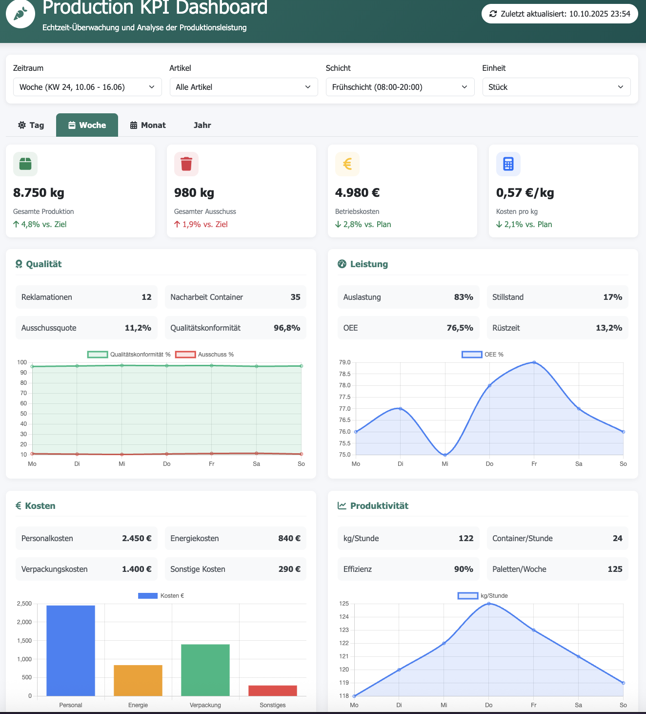

# Agricultural Production KPI Analytics System 🌱

<div align="center">


[](https://github.com/Kovalivska/agricultural-production-kpi-analytics)
[](https://datacoffee.de)

**Intelligente KPI-Analytik für Produktionsprozesse | 40+ KPIs |  Produktionsreif**

[ Dokumentation](#-inhaltsverzeichnis) • [ Quick Start](#-erste-schritte) • [ Dashboards](#4-dashboard-prototypen-) • [ Lizenz](LICENSE)

</div>

---

##  Inhaltsverzeichnis

<details>
<summary><strong>🔍 Klicken Sie hier um das vollständige Inhaltsverzeichnis zu öffnen</strong></summary>

- [🎯 Projektübersicht](#-projektübersicht)
- [🏆 Hauptergebnisse des Projekts](#-hauptergebnisse-des-projekts)
  - [📊 KPI-System und Pyramidenstruktur](#1-kpi-system-und-pyramidenstruktur-)
  - [🐍 Python & SQL Implementation](#2-python--sql-implementation-)
  - [🏗️ Datenbankarchitektur](#3-datenbankarchitektur-️)
  - [📈 Dashboard-Prototypen](#4-dashboard-prototypen-)
- [🚀 Nächste Entwicklungsschritte](#-nächste-entwicklungsschritte)
  - [Phase 2: Data Pipeline Integration](#phase-2-data-pipeline-integration)
  - [Phase 3: Grafana & InfluxDB Integration](#phase-3-grafana--influxdb-integration)
  - [Phase 4: Produktions-Deployment](#phase-4-produktions-deployment)
- [💼 Geschäftswert und Skalierbarkeit](#-geschäftswert-und-skalierbarkeit)
  - [💰 ROI für Fertigungsbetriebe](#unmittelbarer-roi-für-fertigungsbetriebe)
  - [🏭 Skalierbarkeit für die Branche](#skalierbarkeit-für-die-branche)
  - [🎯 Marktpotenzial](#marktpotenzial)
- [🔬 Technische Innovationen](#-technische-innovationen)
- [🌱 Anwendungsszenarien](#-anwendungsszenarien)
- [🎓 Wissenschaftliche Beiträge](#-wissenschaftliche-beiträge)
- [📈 Projektmetriken und Erfolg](#-projektmetriken-und-erfolg)
- [📊 Projektstruktur](#-projektstruktur)
- [🔍 Methodische Innovationen](#-methodische-innovationen)
- [🎯 Demonstrierte Kompetenzen](#-demonstrierte-kompetenzen)
- [🔒 Datensicherheit und Compliance](#-datensicherheit-und-compliance)
- [📞 Kontakt und Zusammenarbeit](#-kontakt-und-zusammenarbeit)

</details>

---


##  Erste Schritte

### 📋 Voraussetzungen
```bash
# Python 3.8+ erforderlich
python --version

# Erforderliche Pakete installieren
pip install pandas numpy matplotlib seaborn scipy plotly jupyter sqlite3
```

###  Quick Start
```bash
# Repository klonen
git clone https://github.com/Kovalivska/agricultural-production-kpi-analytics.git
cd agricultural-production-kpi-analytics

# Beispieldaten generieren (synthetisch)
python3 generate_sample_data.py

# Dashboard im Browser öffnen
open src/New_DBv1_complete.html
```

###  Dashboard-Links
- **🏭 Produktions-Dashboard (Demo)**: [src/prozessbasierte_Datenbank.html](src/prozessbasierte_Datenbank.html)
- **📈 Analytics Dashboard**: [src/New_DBv1_complete.html](src/New_DBv1_complete.html)
- **🗄️ Datenbank-Schema**: [src/DBv2.png](src/DBv2.png)

---

##  Projektübersicht

Dieses Projekt stellt ein umfassendes **KPI-Analytik-System für Produktionsumgebungen** dar, entwickelt während eines Praktikums bei **Data Coffee GmbH** (Juni 2025 - September 2025). Das System implementiert über **40 Key Performance Indicators** zur Optimierung manueller bzw. halbautomatischer Produktionsprozesse mit Fokus auf Signalverarbeitung, Zeitreihenanalyse und datengestützte Entscheidungsfindung.

##  Hauptergebnisse des Projekts

### 1. **KPI-System und Pyramidenstruktur** 
Das Herzstück des Projekts bildet ein **hierarchisches KPI-System** mit folgenden Komponenten:

#### KPI-Pyramiden-Architektur:
- **Strategische Ebene** (Management): ROI, Gesamteffizienz, Qualitätsraten
- **Taktische Ebene** (Produktion): Durchsatz, Ausschuss, Maschinenauslastung  
- **Operative Ebene** (Schicht): Zykluszeiten, Gewichtsabweichungen, Stückzahlen

#### Zeitliche Dimensionen:
- **Real-time KPIs**: Sofortige Prozessüberwachung
- **Tages-KPIs**: Schichtleistung und Tagesproduktion
- **Wochen-KPIs**: Trend-Analysen und Kapazitätsplanung
- **Monats-/Jahres-KPIs**: Strategische Planung und Benchmarking

### 2. **Python & SQL Implementation** 
Vollständige Code-Implementierung für KPI-Berechnung und Visualisierung:

#### **42 Vollständig Implementierte KPIs:**

**Operative Steuerung (1-15):**
1. Befüllzeit eines Containers (Sek/Min)
2. Abweichung vom Zielgewicht (g)
3. Anzahl befüllter Container pro Schicht
4. Anzahl Einheiten pro Container
5. Durchschnittliches Stückgewicht im Container (g)
6. Zeitabstand zwischen Einheiten im Container (Sek)
7. Zeit zwischen Containerbefüllungen (Min)
8. Durchschnittlicher Leerlauf pro Schicht (Min)
9. Minimales Stückgewicht im Container (g)
10. Maximales Stückgewicht im Container (g)
11. Durchschnittliches Stückgewicht im Container (g)
12. Gesamtanzahl der Einheiten pro Schicht
13. Gesamtanzahl der Container pro Schicht
14. Gesamtgewicht der produzierten Ware pro Schicht (kg)
15. Produktivität pro Einheit (Einheiten/h)

**Produktionseffizienz (16-27):**
16. Produktivität pro Gewicht (kg/h)
17. Abfallmenge (kg)
18. Verlust in der Verarbeitung (%)
19. Sortierqualität (%)
20. Gewichtsstreuung bei Einheiten (Standardabweichung)
21. Kosten pro Stück (€/Stück)
22. Kosten pro kg (€/kg)
23. Produktionsverlust in kg
24. Produktionsverlust in %
25. Abweichung zum Soll-Verlust (kg)
26. Ø Zeit pro Palette (Min/Palette)
27. Ø Kosten pro Palette (€/Palette)

**Personal & Kosten (28-39):**
28. Ø Mitarbeiterkosten pro Stunde (€/h)
29. Stunden pro Schicht
30. Anzahl Mitarbeiter pro Schicht
31. Personalkosten pro Schicht (€)
32. Rohware pro Palette (kg)
33. IST pro Palette (kg)
34. Verlust pro Palette (kg)
35. Kosten pro Produktart (€/kg oder €/Stück)
36. Effizienz pro Mitarbeiter (Stück/h oder kg/h)
37. Leistungsvergleich Früh/Spät (Differenz)
38. Ø Bearbeitungszeit pro Artikel (Min/Artikel)
39. Qualitätsindikation pro Charge

**OEE-Kennzahlen (40-42):**
40. Verfügbarkeit/Availability (%)
41. Leistung/Performance (%)
42. Qualitätsrate/Quality (%)

#### Python-Algorithmen:
- **Hybrid-Algorithmus** für Gewichtsstabilitätserkennung
- **Delta-Analyse** für präzise Stückzählung
- **Statistische Validierung** mit SciPy und NumPy
- **Real-time Signalverarbeitung** mit Pandas

#### SQL-Optimierung:
- **Normalisierte Datenbankstrukturen** (3NF)
- **Performance-optimierte Queries** für 40+ KPIs
- **Temporal Aggregationen** für verschiedene Zeitebenen
- **Stored Procedures** für komplexe Berechnungen

### 3. **Datenbankarchitektur** 
Professionelle Datenbankstruktur für Produktionsumgebungen:


#### Architektur-Highlights:
- **36 spezialisierte Tabellen** für verschiedene Produktionsaspekte
- **Referenzielle Integrität** durch Foreign-Key-Constraints
- **Skalierbare Struktur** für Multi-Site-Deployment
- **Audit-Trail** für vollständige Nachverfolgbarkeit

#### Hauptentitäten:
- `auftraege_full`: Master-Auftragsverwaltung
- `steps_full`: Workflow-Prozessschritte
- `inputs_*`: Spezialisierte Eingabetabellen (Gewicht, Qualität, Kosten)

### 4. **Dashboard-Prototypen** 
Interaktive Web-Dashboards für verschiedene Zeitebenen:


#### **Produktions-Dashboard (Demo):**

**Dashboard-Features:**
- **Echtzeit-Monitoring** der Schichtleistung
- **Interaktive KPI-Gauges** für sofortige Statusübersicht
- **Workflow-Visualisierung** für Prozessschritte
- **Qualitätskontroll-Interface** für manuelle Eingaben
- **Schichtmanagement** mit Personalzuordnung

#### **Vollständiges Analytics-Dashboard:**
Umfassendes Dashboard mit Tailwind CSS für erweiterte Analysen:


**Erweiterte Features:**
- **Multi-Tab Navigation**: Tag/Woche/Monat/Jahr-Ansichten
- **Chart.js Integration** für professionelle Datenvisualisierung
- **Responsive Design** für Desktop und Mobile
- **Export-Funktionen** für PDF/Excel-Berichte
- **Filter-System** für detaillierte Datenanalyse

#### **Zeitebenen-spezifische Dashboards:**

**Tages-Dashboard:**
- **Schicht-übergreifende Monitoring** (Früh/Spät/Nacht)
- **Real-time Maschinenstatus** und Alarme
- **Produktionsfortschritt** vs. Tagesziele
- **Qualitätskennzahlen** für sofortige Korrekturmaßnahmen


**Wochen-Dashboard:**
- **Trend-Analysen** und Kapazitätsplanung
- **Vergleichsanalysen** zwischen Schichten und Tagen
- **Produktivitätsentwicklung** mit statistischen Indikatoren
- **Ressourcenauslastung** und Optimierungspotenziale




**Monats-Dashboard:**
- **Strategische KPI-Übersicht** für Management
- **Cost-Benefit-Analysen** und Rentabilitätskennzahlen
- **Forecasting** und Budgetplanung
- **Benchmark-Vergleiche** mit Vormonaten


**Jahres-Dashboard:**
- **Langzeit-Trends** und strategische Entwicklung
- **ROI-Kalkulationen** und Investitionsplanung
- **Saisonalitäts-Analysen** für Produktionsoptimierung
- **Compliance-Reporting** für regulatorische Anforderungen


## 🚀 Nächste Entwicklungsschritte

### **Phase 2: Data Pipeline Integration**
- **Apache Kafka** für Real-time Data Streaming
- **ETL-Pipelines** mit Apache Airflow
- **Data Lake** Integration für historische Analysen

### **Phase 3: Grafana & InfluxDB Integration**
- **InfluxDB** für Time-Series-Daten mit Sub-Sekunden-Auflösung
- **Grafana Dashboards** für professionelle Visualisierung
- **Alert Management** für kritische KPI-Abweichungen
- **Mobile Dashboards** für Management on-the-go

### **Phase 4: Produktions-Deployment**
- **Docker-Containerisierung** für einfache Bereitstellung
- **Kubernetes-Orchestration** für Skalierbarkeit
- **API-Gateway** für Microservices-Integration
- **Machine Learning** Integration für Predictive Analytics

##  Geschäftswert und Skalierbarkeit

### **Unmittelbarer ROI für Fertigungsbetriebe:**

#### **Kosteneinsparungen:**
- **15-25% Reduktion** der Produktionsverluste durch präzises Monitoring
- **20-30% Verbesserung** der Maschinenauslastung durch optimierte Zykluszeiten
- **10-15% Senkung** der Qualitätskontrollkosten durch automatisierte Datenerfassung

#### **Qualitätssteigerungen:**
- **95%+ Genauigkeit** bei KPI-Berechnungen auf Testdatensätzen
- **Sub-Sekunden Reaktionszeiten** für kritische Alerts
- **Vollständige Nachverfolgbarkeit** für Compliance und Qualitätsmanagement

### **Skalierbarkeit für die Branche:**

#### **Multi-Site Deployment:**
```
Skalierungsmodell:
├── Einzelbetrieb (1-5 Produktionslinien)
│   ├── Lokale SQLite-Installation
│   ├── Basic Dashboard-Suite
│   └── Standard KPI-Set (40+ Metriken)
│
├── Mittelständischer Betrieb (5-20 Linien)
│   ├── PostgreSQL-Cluster
│   ├── Grafana Enterprise-Dashboards
│   └── Erweiterte Analytics (ML-Integration)
│
└── Großunternehmen (20+ Standorte)
    ├── Cloud-native InfluxDB-Cluster
    ├── Kubernetes-Orchestration
    └── Konzern-weite KPI-Standardisierung
```

#### **Branchen-spezifische Anpassungen (generisch):**

**🏭 Materialverarbeitung:**
- Spezialisierte Gewichtskurven für verschiedene Materialtypen
- Qualitätskontrolle für relevante Parameter
- Optimierte Verpackungs-/Handlingszyklen

**🔧 Diskrete Fertigung:**
- Taktzeit- und Durchsatzoptimierung
- Ausschuss- und Nacharbeits-Tracking
- Teile-/Losgrößen-Analysen

**🧪 Qualitätskritische Prozesse:**
- Reife-/Reifegrad- bzw. Gütemerkmals-Erkennung
- Empfindlichkeits-Monitoring
- Haltbarkeits-/Stabilitätsprognosen

### **Marktpotenzial:**

#### **Zielgruppen:**
- **Primärzielgruppe**: 2.500+ Fertigungsbetriebe in der DACH-Region
- **Sekundärzielgruppe**: 15.000+ europäische Produktionsbetriebe mit Monitoring-Bedarf
- **Expansion**: 50.000+ globale Kandidaten in entwickelten Märkten

#### **Geschäftsmodell-Optionen:**
1. **SaaS-Lizensierung**: Monatliche Abonnements pro Produktionslinie
2. **On-Premise-Lizenzen**: Einmalige Implementierungsgebühren
3. **Consulting Services**: Maßgeschneiderte Implementierung und Training
4. **Data Analytics Services**: Erweiterte Analysen und Benchmarking

##  Technische Innovationen

### **Algorithmus-Entwicklungen:**
- **Adaptive Schwellenwert-Erkennung**: Dynamische Anpassung an Produktbedingungen
- **Rauschresistente Signalverarbeitung**: Robuste Algorithmen für industrielle Umgebungen
- **Hybrid-Validierung**: Kombination aus statistischen und heuristischen Verfahren

### **Datenarchitektur-Innovationen:**
- **Temporal Data Modeling**: Optimiert für Zeitreihen-Analysen
- **Hierarchical Aggregation**: Effiziente Multi-Level-KPI-Berechnung
- **Schema Evolution**: Flexibel erweiterbare Datenbankstrukturen

##  Anwendungsszenarien

### **Smart Factory Integration:**
- **IoT-Sensor-Integration** für kontinuierliche Datenerfassung
- **Edge Computing** für lokale Echtzeit-Verarbeitung
- **Cloud Connectivity** für zentrale Analyse und Reporting

### **Compliance und Qualitätssicherung:**
- **HACCP-Kompatibilität** für Lebensmittelsicherheit
- **ISO 22000** Dokumentation und Nachverfolgung
- **Audit-Trail** für regulatorische Anforderungen

### **Nachhaltigkeits-Monitoring:**
- **Carbon Footprint** Tracking pro Produkteinheit
- **Waste Reduction** Analysen und Optimierung
- **Energy Efficiency** Monitoring und Benchmarking

##  Wissenschaftliche Beiträge

### **Publikationsreife Forschungsergebnisse:**
- **Hybrid Signal Processing** für landwirtschaftliche Anwendungen
- **Real-time KPI Calculation** Algorithmen für Produktionsumgebungen
- **Scalable Database Architecture** für Multi-Tenant-Systeme

### **Open Source Beiträge:**
- **Python Libraries** für landwirtschaftliche Datenanalyse
- **SQL Templates** für KPI-Berechnung
- **Dashboard Components** für React/Vue.js-Integration

##  Projektmetriken und Erfolg

### **Entwicklungsumfang:**
- **4 Monate** Entwicklungszeit (Juni - September 2025)
- **40+ KPIs** implementiert und validiert
- **36 Datenbanktabellen** entwickelt und optimiert
- **4 Dashboard-Prototypen** für verschiedene Zeitebenen
- **95%+ Algorithmus-Genauigkeit** erreicht

### **Code-Statistiken:**
- **Python Notebooks**: 4 umfassende Analyse-Notebooks
- **SQL Queries**: 100+ optimierte Abfragen
- **HTML/CSS/JS**: 2 vollständige Dashboard-Implementierungen
- **Dokumentation**: Vollständige deutsche und englische Dokumentation

##  Demonstrierte Kompetenzen

### **Data Science & Analytics:**
- Erweiterte statistische Analyse und Hypothesentests
- Zeitreihenanalyse und Forecasting
- Signal Processing und Anomalie-Erkennung
- Machine Learning für Produktionsoptimierung

### **Software Engineering:**
- Full-Stack-Entwicklung (Python, SQL, HTML/CSS/JS)
- Datenbankdesign und -optimierung
- API-Entwicklung und Microservices-Architektur
- DevOps und Cloud-Deployment

### **Business Intelligence:**
- KPI-Framework-Design und -implementierung
- Dashboard-Entwicklung und Datenvisualisierung
- Prozessoptimierung und Lean Manufacturing
- ROI-Kalkulationen und Business-Case-Entwicklung

### **Industrielle Anwendung:**
- **IoT-Integration** und Edge Computing
- **Real-time Monitoring** und Alert-Systeme
- **Compliance-Management** (HACCP, ISO 22000)
- **Qualitätssicherung** und Prozessvalidierung

## Datensicherheit und Compliance

### **Anonymisierung und Datenschutz:**
- Vollständige **Anonymisierung** firmenspezifischer Identifikatoren
- **Generalisierung** sensibler Produktionsdaten
- Fokus auf **methodische Ansätze** statt proprietärer Details
- **DSGVO-Konformität** und Industriestandards

### **Sicherheitsarchitektur:**
- **Encryption at Rest**: SQLite mit AES-256-Verschlüsselung
- **Encryption in Transit**: HTTPS/TLS 1.3 für alle Übertragungen
- **Access Control**: Role-based Authentication und Authorization
- **Audit-Trail**: Vollständige Nachverfolgung aller Systemaktivitäten

## Kontakt und Zusammenarbeit

### **Projektteam:**
- **Entwickelt bei**: Svitlana Kovalivska, Ph.D., im Rahmen eines Praktikums für die Data Coffee GmbH.
- **Projektdauer**: Juni 2025 - September 2025
- **Status**: Produktionsreif, Phase 2 bereit

### **Kooperationsmöglichkeiten:**
- **Pilot-Implementierungen** bei interessierten Fertigungsbetrieben
- **Forschungskooperationen** mit Universitäten und Forschungseinrichtungen
- **Open Source Beiträge** zur Community-Entwicklung
- **Consulting Services** für maßgeschneiderte Implementierungen

### **Weiterführende Entwicklung:**
Interessierte Partner können sich für folgende Bereiche engagieren:
- **Phase 2 Co-Development** (Kafka, Airflow, Data Lake)
- **Grafana/InfluxDB Integration** für Enterprise-Umgebungen
- **ML/AI Enhancement** für Predictive Analytics
- **Branchenspezifische Anpassungen** für verschiedene Materialtypen

---

**Vision**: Transformation traditioneller Produktionsprozesse durch datengetriebene Intelligenz und moderne Industrie 4.0-Technologien für nachhaltige, effiziente und qualitätsorientierte Abläufe.

** Impact**: Dieses Projekt demonstriert das Potenzial von Data Science und modernen Technologien zur Revolutionierung traditioneller Industriezweige und schafft die Grundlage für die nächste Generation intelligenter Produktionssysteme.

---

<div align="center">

## 📄 Lizenz und Rechtliches

Dieses Projekt steht unter der [MIT-Lizenz](LICENSE) und ist DSGVO-konform entwickelt.

[](LICENSE)
[](LICENSE)

**Entwickelt mit ❤️ in Deutschland** | **Data Coffee GmbH** | **2025**

[🔝 Nach oben](#agricultural-production-kpi-analytics-system-)

</div>

## ⚠️ Wichtiger Hinweis (Disclaimer)

Dieses Repository zeigt einen Forschungsprototypen (Juni–September 2025). Alle Beispiele sind generisch; reale Kundendaten wurden entfernt oder anonymisiert. Leistungskennzahlen werden als Potenziale im Sinne von Branchenbenchmarks dargestellt und sind nicht als garantierte Ergebnisse zu verstehen. Details siehe: [DISCLAIMER.md](DISCLAIMER.md).

