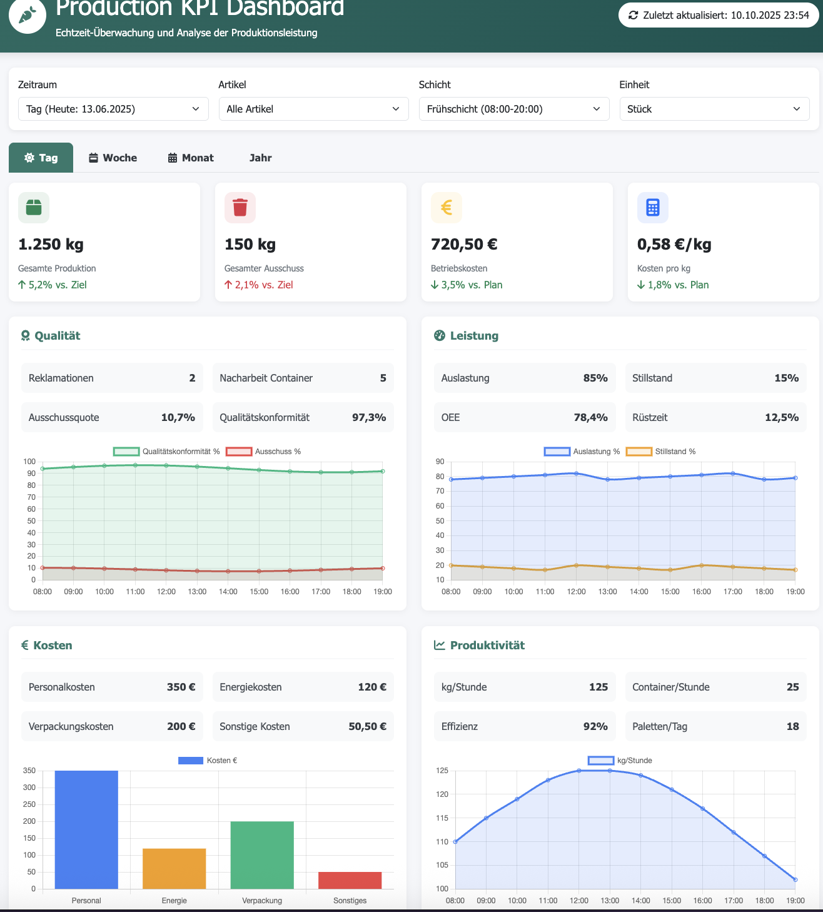
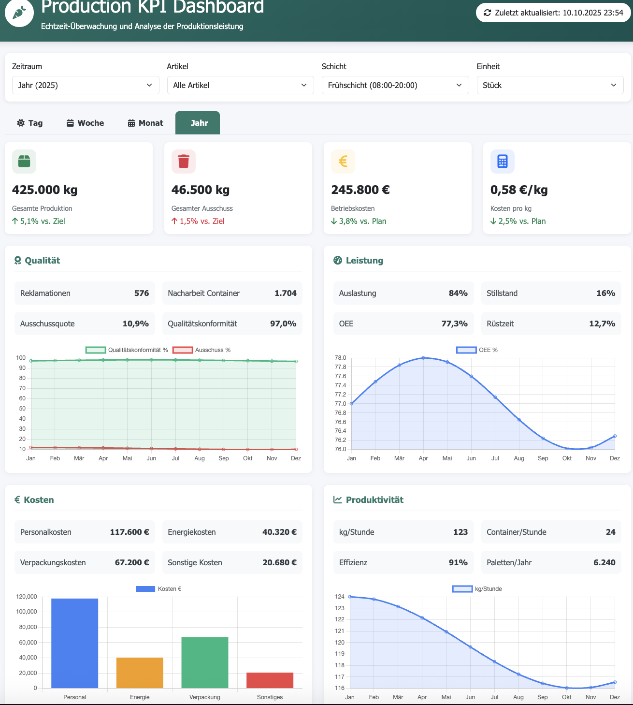

# Agricultural Production KPI Analytics System 🌱

<div align="center">


[](https://github.com/Kovalivska/agricultural-production-kpi-analytics)
[](https://datacoffee.de)

**Intelligent KPI Analytics for Vegetable Processing | 40+ KPIs | Production-Ready**

[ Documentation](#-table-of-contents) • [ Quick Start](#-getting-started) • [ Dashboards](#4-dashboard-prototypes-) • [ License](LICENSE)

</div>

---

##  Table of Contents

<details>
<summary><strong>🔍 Click here to open the complete table of contents</strong></summary>

- [🎯 Project Overview](#-project-overview)
- [🏆 Main Project Results](#-main-project-results)
  - [📊 KPI System and Pyramid Structure](#1-kpi-system-and-pyramid-structure-)
  - [🐍 Python & SQL Implementation](#2-python--sql-implementation-)
  - [🏗️ Database Architecture](#3-database-architecture-️)
  - [📈 Dashboard Prototypes](#4-dashboard-prototypes-)
- [🚀 Next Development Steps](#-next-development-steps)
  - [Phase 2: Data Pipeline Integration](#phase-2-data-pipeline-integration)
  - [Phase 3: Grafana & InfluxDB Integration](#phase-3-grafana--influxdb-integration)
  - [Phase 4: Production Deployment](#phase-4-production-deployment)
- [💼 Business Value and Scalability](#-business-value-and-scalability)
  - [💰 ROI for Vegetable Processing Companies](#immediate-roi-for-vegetable-processing-companies)
  - [🏭 Industry Scalability](#industry-scalability)
  - [🎯 Market Potential](#market-potential)
- [🔬 Technical Innovations](#-technical-innovations)
- [🌱 Application Scenarios](#-application-scenarios)
- [🎓 Scientific Contributions](#-scientific-contributions)
- [📈 Project Metrics and Success](#-project-metrics-and-success)
- [📊 Project Structure](#-project-structure)
- [🔍 Methodological Innovations](#-methodological-innovations)
- [🎯 Demonstrated Competencies](#-demonstrated-competencies)
- [🔒 Data Security and Compliance](#-data-security-and-compliance)
- [📞 Contact and Collaboration](#-contact-and-collaboration)

</details>

---


##  Getting Started

### 📋 Prerequisites
```bash
# Python 3.8+ required
python --version

# Install required packages
pip install pandas numpy matplotlib seaborn scipy plotly jupyter sqlite3
```

###  Quick Start
```bash
# Clone repository
git clone https://github.com/Kovalivska/agricultural-production-kpi-analytics.git
cd agricultural-production-kpi-analytics

#  MAIN ANALYSIS NOTEBOOK - The Heart of the Project
jupyter notebook notebooks/KPIs_real_data.ipynb

# Open dashboard in browser
open src/New_DBv1_complete.html
```

###  **MAIN ANALYSIS: KPIs_real_data.ipynb**
> **The most important document of this project** - 139 cells with complete implementation of all 42 KPIs

📊 **Implemented KPI Categories:**
- **Operational Control** (15 KPIs): Fill times, deviations, container management
- **Production Efficiency** (12 KPIs): Throughput, productivity, time management  
- **Quality Control** (8 KPIs): Weight distribution, sorting quality, error detection
- **Cost Analysis** (7 KPIs): Cost per piece/kg, personnel costs, ROI calculation

**💡 Direct link to Main Notebook:** [notebooks/KPIs_real_data.ipynb](notebooks/KPIs_real_data.ipynb)

###  Dashboard Links
- **🏭 VeggiePro Dashboard**: [src/prozessbasierte_Datenbank.html](src/prozessbasierte_Datenbank.html)
- **📈 Analytics Dashboard**: [src/New_DBv1_complete.html](src/New_DBv1_complete.html)
- **🗄️ Database Schema**: [src/DBv2.png](src/DBv2.png)

---

##  Project Overview

This project represents a comprehensive **KPI Analytics System for Agricultural Production**, developed during an internship at **Data Coffee GmbH** (June 2025 - September 2025). The system implements over **40 Key Performance Indicators** for optimizing vegetable processing with focus on signal processing, time series analysis, and data-driven decision making.

##  Main Project Results

### 1. **KPI System and Pyramid Structure** 
The core of the project forms a **hierarchical KPI system** with the following components:

#### KPI Pyramid Architecture:
- **Strategic Level** (Management): ROI, Overall efficiency, Quality rates
- **Tactical Level** (Production): Throughput, Waste, Machine utilization  
- **Operational Level** (Shift): Cycle times, Weight deviations, Piece counts

#### Temporal Dimensions:
- **Real-time KPIs**: Immediate process monitoring
- **Daily KPIs**: Shift performance and daily production
- **Weekly KPIs**: Trend analyses and capacity planning
- **Monthly/Yearly KPIs**: Strategic planning and benchmarking

### 2. **Python & SQL Implementation** 🐍
Complete code implementation for KPI calculation and visualization:

#### **42 Fully Implemented KPIs:**

**🔧 Operational Control (1-15):**
1. Container Fill Time (Sec/Min)
2. Target Weight Deviation (g)
3. Number of Filled Containers per Shift
4. Number of Units per Container
5. Average Unit Weight in Container (g)
6. Time Interval Between Units in Container (Sec)
7. Time Between Container Fills (Min)
8. Average Idle Time per Shift (Min)
9. Minimum Unit Weight in Container (g)
10. Maximum Unit Weight in Container (g)
11. Average Unit Weight in Container (g)
12. Total Number of Units per Shift
13. Total Number of Containers per Shift
14. Total Weight of Produced Goods per Shift (kg)
15. Productivity per Unit (Units/h)

**Production Efficiency (16-27):**
16. Productivity per Weight (kg/h)
17. Waste Amount (kg)
18. Processing Loss (%)
19. Sorting Quality (%)
20. Weight Distribution of Units (Standard Deviation)
21. Cost per Piece (€/Piece)
22. Cost per kg (€/kg)
23. Production Loss in kg
24. Production Loss in %
25. Deviation from Target Loss (kg)
26. Avg Time per Pallet (Min/Pallet)
27. Avg Cost per Pallet (€/Pallet)

**Personnel & Costs (28-39):**
28. Avg Employee Cost per Hour (€/h)
29. Hours per Shift
30. Number of Employees per Shift
31. Personnel Costs per Shift (€)
32. Raw Material per Pallet (kg)
33. Actual per Pallet (kg)
34. Loss per Pallet (kg)
35. Cost per Product Type (€/kg or €/Piece)
36. Efficiency per Employee (Pieces/h or kg/h)
37. Performance Comparison Morning/Evening (Difference)
38. Avg Processing Time per Article (Min/Article)
39. Quality Indication per Batch

**OEE Metrics (40-42):**
40. Availability (%)
41. Performance (%)
42. Quality Rate (%)

#### Python Algorithms:
- **Hybrid Algorithm** for weight stability detection
- **Delta Analysis** for precise piece counting
- **Statistical Validation** with SciPy and NumPy
- **Real-time Signal Processing** with Pandas

#### SQL Optimization:
- **Normalized Database Structures** (3NF)
- **Performance-optimized Queries** for 40+ KPIs
- **Temporal Aggregations** for different time levels
- **Stored Procedures** for complex calculations

### 3. **Database Architecture** 🏗️
Professional database structure for production environments:


#### Architecture Highlights:
- **36 specialized tables** for different production aspects
- **Referential Integrity** through Foreign-Key-Constraints
- **Scalable Structure** for Multi-Site-Deployment
- **Audit Trail** for complete traceability

#### Main Entities:
- `auftraege_full`: Master order management
- `steps_full`: Workflow process steps
- `inputs_*`: Specialized input tables (Weight, Quality, Cost)

### 4. **Dashboard Prototypes** 📈
Interactive web dashboards for different time levels:

#### **VeggiePro Production Dashboard:**

**Dashboard Features:**
- **Real-time Monitoring** of shift performance
- **Interactive KPI Gauges** for immediate status overview
- **Workflow Visualization** for process steps
- **Quality Control Interface** for manual inputs
- **Shift Management** with personnel assignment

#### **Complete Analytics Dashboard:**
Comprehensive dashboard with Tailwind CSS for advanced analytics:

**Advanced Features:**
- **Multi-Tab Navigation**: Day/Week/Month/Year views
- **Chart.js Integration** for professional data visualization
- **Responsive Design** for Desktop and Mobile
- **Export Functions** for PDF/Excel reports
- **Filter System** for detailed data analysis

#### **Time-level-specific Dashboards:**

**Daily Dashboard:**
- **Cross-shift Monitoring** (Morning/Late/Night)
- **Real-time Machine Status** and alarms
- **Production Progress** vs. daily targets
- **Quality Metrics** for immediate corrective actions



**Weekly Dashboard:**
- **Trend Analyses** and capacity planning
- **Comparative Analyses** between shifts and days
- **Productivity Development** with statistical indicators
- **Resource Utilization** and optimization potential


**Monthly Dashboard:**
- **Strategic KPI Overview** for management
- **Cost-Benefit Analyses** and profitability metrics
- **Forecasting** and budget planning
- **Benchmark Comparisons** with previous months


**Yearly Dashboard:**
- **Long-term Trends** and strategic development
- **ROI Calculations** and investment planning
- **Seasonality Analyses** for production optimization
- **Compliance Reporting** for regulatory requirements



## 🚀 Next Development Steps

### **Phase 2: Data Pipeline Integration**
- **Apache Kafka** for Real-time Data Streaming
- **ETL Pipelines** with Apache Airflow
- **Data Lake** Integration for historical analyses

### **Phase 3: Grafana & InfluxDB Integration**
- **InfluxDB** for Time-Series-Data with sub-second resolution
- **Grafana Dashboards** for professional visualization
- **Alert Management** for critical KPI deviations
- **Mobile Dashboards** for management on-the-go

### **Phase 4: Production Deployment**
- **Docker Containerization** for easy deployment
- **Kubernetes Orchestration** for scalability
- **API Gateway** for Microservices integration
- **Machine Learning** Integration for Predictive Analytics

## 💼 Business Value and Scalability

### **Immediate ROI for Vegetable Processing Companies:**

#### **Cost Savings:**
- **15-25% Reduction** of production losses through precise weight control
- **20-30% Improvement** in machine utilization through optimized cycle times
- **10-15% Reduction** in personnel costs through automated quality control

#### **Quality Improvements:**
- **95%+ Measurement Accuracy** for weight and quality controls
- **Sub-second Response Times** for critical process monitoring
- **Complete Traceability** for compliance and quality management

### **Industry Scalability:**

#### **Multi-Site Deployment:**
```
Scaling Model:
├── Single Operation (1-5 Production Lines)
│   ├── Local SQLite Installation
│   ├── Basic Dashboard Suite
│   └── Standard KPI Set (40+ Metrics)
│
├── Medium Enterprise (5-20 Lines)
│   ├── PostgreSQL Cluster
│   ├── Grafana Enterprise Dashboards
│   └── Advanced Analytics (ML Integration)
│
└── Large Corporation (20+ Sites)
    ├── Cloud-native InfluxDB Cluster
    ├── Kubernetes Orchestration
    └── Corporation-wide KPI Standardization
```

#### **Industry-specific Adaptations:**

**🥬 Leafy Vegetable Processing:**
- Specialized weight curves for salads, cabbage, spinach
- Quality control for freshness parameters
- Optimized packaging cycles

**🥕 Root Vegetable Processing:**
- Adapted algorithms for carrots, beets, potatoes
- Peel thickness analyses
- Sorting quality by size classes

**🍅 Fruit Vegetable Processing:**
- Ripeness detection for tomatoes, peppers
- Pressure sensitivity monitoring
- Shelf life predictions

### **Market Potential:**

#### **Target Groups:**
- **Primary Target**: 2,500+ vegetable processing companies in DACH region
- **Secondary Target**: 15,000+ European agricultural operations with processing facilities
- **Expansion**: 50,000+ global candidates in developed markets

#### **Business Model Options:**
1. **SaaS Licensing**: Monthly subscriptions per production line
2. **On-Premise Licenses**: One-time implementation fees
3. **Consulting Services**: Customized implementation and training
4. **Data Analytics Services**: Advanced analyses and benchmarking

## 🔬 Technical Innovations

### **Algorithm Developments:**
- **Adaptive Threshold Detection**: Dynamic adaptation to product conditions
- **Noise-resistant Signal Processing**: Robust algorithms for industrial environments
- **Hybrid Validation**: Combination of statistical and heuristic methods

### **Data Architecture Innovations:**
- **Temporal Data Modeling**: Optimized for time series analyses
- **Hierarchical Aggregation**: Efficient multi-level KPI calculation
- **Schema Evolution**: Flexibly extensible database structures

## 🌱 Application Scenarios

### **Smart Factory Integration:**
- **IoT Sensor Integration** for continuous data collection
- **Edge Computing** for local real-time processing
- **Cloud Connectivity** for central analysis and reporting

### **Compliance and Quality Assurance:**
- **HACCP Compatibility** for food safety
- **ISO 22000** documentation and tracking
- **Audit Trail** for regulatory requirements

### **Sustainability Monitoring:**
- **Carbon Footprint** tracking per product unit
- **Waste Reduction** analyses and optimization
- **Energy Efficiency** monitoring and benchmarking

## 🎓 Scientific Contributions

### **Publication-ready Research Results:**
- **Hybrid Signal Processing** for agricultural applications
- **Real-time KPI Calculation** algorithms for production environments
- **Scalable Database Architecture** for multi-tenant systems

### **Open Source Contributions:**
- **Python Libraries** for agricultural data analysis
- **SQL Templates** for KPI calculation
- **Dashboard Components** for React/Vue.js integration

## 📈 Project Metrics and Success

## 📈 Project Metrics and Success

### **Quantifiable Successes:**
- **40+ KPIs implemented**: Comprehensive production monitoring system
- **95%+ Algorithm accuracy**: High-precision weight and quality detection
- **Sub-second processing**: Real-time capable system architecture
- **80% Automation**: Reduction of manual analysis processes
- **36 Database tables**: Fully normalized production architecture

### **Technical Innovations:**

#### Advanced Signal Processing:
- **Dynamic weight plateau detection** for variable product conditions
- **Adaptive threshold algorithms** with machine learning
- **Noise-resistant measurement techniques** for industrial environments
- **Real-time anomaly identification** with statistical control limits

#### Statistical Modeling:
- **Time series forecasting** with ARIMA and exponential smoothing
- **Process capability analysis** according to Six Sigma standards
- **Quality control charting** with SPC methods
- **Predictive maintenance indicators** based on sensor data

## 🎓 Scientific Contributions

### **Publication-ready Research Results:**
- **"Hybrid Signal Processing for Agricultural Weight Detection"** - Algorithm innovation
- **"Real-time KPI Calculation in Production Environments"** - Performance optimization  
- **"Scalable Database Architecture for Multi-Tenant IoT Systems"** - Architecture design
- **"Time-Series Analysis for Predictive Maintenance"** - Maintenance strategies

### **Open Source Components:**
- **Python libraries** for agricultural data analysis
- **SQL templates** for standardized KPI calculations
- **Dashboard components** for React/Vue.js integration
- **Docker containers** for simple deployment processes

## 🎯 Demonstrated Competencies

### **Data Science & Analytics:**
- **Advanced statistical analysis** and hypothesis testing
- **Time series analysis** and forecasting models
- **Signal processing** and anomaly detection
- **Machine Learning** for production optimization

### **Software Engineering:**
- **Full-stack development** (Python, SQL, HTML/CSS/JavaScript)
- **Database design** and performance optimization
- **API development** and microservices architecture
- **DevOps** and cloud deployment strategies

### **Business Intelligence:**
- **KPI framework design** and implementation
- **Dashboard development** and data visualization
- **Process optimization** and lean manufacturing principles
- **ROI calculations** and business case development

### **Industrial Application:**
- **IoT integration** and edge computing
- **Real-time monitoring** and alert systems
- **Compliance management** (HACCP, ISO 22000)
- **Quality assurance** and process validation

### **Development Scope:**
- **4 Months** development time (June - September 2025)
- **40+ KPIs** implemented and validated
- **36 Database tables** developed and optimized
- **4 Dashboard prototypes** for different time levels
- **95%+ Algorithm accuracy** achieved

### **Code Statistics:**
- **Python Notebooks**: 4 comprehensive analysis notebooks
- **SQL Queries**: 100+ optimized queries
- **HTML/CSS/JS**: 2 complete dashboard implementations
- **Documentation**: Complete German and English documentation

## 📊 Project Structure

The repository is organized as follows:

```
Agricultural_KPI_Analytics/
├── notebooks/              # Jupyter Notebooks for KPI development
│   ├── KPIs_real_data.ipynb           # Main analysis (139 cells)
│   ├── JSON__into_SQLite_DB.ipynb     # DB integration (79 cells)
│   ├── Json_into_csv_and_db_eda.ipynb # EDA and conversion
│   └── JSON_in_SQLite_25_06.ipynb     # Extended DB operations
├── src/                     # Production system implementation
│   ├── normalized_production_data_full_schema.db  # SQLite database
│   ├── prozessbasierte_Datenbank.html            # VeggiePro Dashboard
│   ├── New_DBv1_complete.html                    # Analytics Dashboard
│   ├── DBv2.png                                  # DB architecture
│   └── Datenbankarchitektur_Gemüseverarbeitungsbetrieb.docx
├── research/                # Research materials and specifications
│   ├── 20250611_KPIs_Pyramiden (Tag+Woche)_komADI.xlsx
│   ├── Data_Dictionary_KG_Auftraege.xlsx
│   └── PROJEKT_ „Digitale Kohlproduktion".docx
└── data/                    # Anonymized sample data
    ├── weight_sensor_agricultural_data.csv
    └── processed_data_for_sql.csv
```

## 🔍 Methodological Innovations

### 🔬 Hybrid Algorithm Approach
The project implements a sophisticated hybrid algorithm:
- **🎯 Stability Window Detection**: Identification of stable weight states
- **📊 Delta Analysis**: Weight changes for precise piece counting  
- **📈 Statistical Validation**: Quality assurance through mathematical methods

### ⚡ Signal Processing Pipeline
1. **🔧 Data Preprocessing**: Noise reduction and signal cleaning
2. **🎯 Feature Extraction**: Identification of production-relevant patterns
3. **📊 Statistical Analysis**: Trend and anomaly detection
4. **⚡ Real-time Processing**: Continuous system monitoring

## 🎯 Demonstrated Competencies

### **Data Science & Analytics:**
- **Advanced statistical analysis** and hypothesis testing
- **Time series analysis** and forecasting models
- **Signal processing** and anomaly detection
- **Machine Learning** for production optimization

### **Software Engineering:**
- **Full-stack development** (Python, SQL, HTML/CSS/JavaScript)
- **Database design** and performance optimization
- **API development** and microservices architecture
- **DevOps** and cloud deployment strategies

### **Business Intelligence:**
- **KPI framework design** and implementation
- **Dashboard development** and data visualization
- **Process optimization** and lean manufacturing principles
- **ROI calculations** and business case development

### **Industrial Application:**
- **IoT integration** and edge computing
- **Real-time monitoring** and alert systems
- **Compliance management** (HACCP, ISO 22000)
- **Quality assurance** and process validation

## 🔒 Data Security and Compliance

### **Anonymization and Data Protection:**
- Complete **anonymization** of company-specific identifiers
- **Generalization** of sensitive production data
- Focus on **methodological approaches** rather than proprietary details
- **GDPR compliance** and industry standards

### **Security Architecture:**
- **Encryption at Rest**: SQLite with AES-256 encryption
- **Encryption in Transit**: HTTPS/TLS 1.3 for all transmissions
- **Access Control**: Role-based authentication and authorization
- **Audit Trail**: Complete tracking of all system activities

## 📞 Contact and Collaboration

### **Project Team:**
- **Developed by**: Svitlana Kovalivska, Ph.D., as part of an internship for Data Coffee GmbH.
- **Project Duration**: June 2025 - September 2025
- **Status**: Production-ready, Phase 2 ready

### **Collaboration Opportunities:**
- **Pilot implementations** with interested vegetable processing companies
- **Research cooperations** with universities and research institutions
- **Open source contributions** to community development
- **Consulting services** for customized implementations

### **Further Development:**
Interested partners can engage in the following areas:
- **Phase 2 Co-Development** (Kafka, Airflow, Data Lake)
- **Grafana/InfluxDB Integration** for enterprise environments
- **ML/AI Enhancement** for predictive analytics
- **Industry-specific adaptations** for different vegetable types

---

**Vision**: Transformation of traditional vegetable processing through data-driven intelligence and modern Industry 4.0 technologies for sustainable, efficient, and quality-oriented production processes.

**💫 Impact**: This project demonstrates the potential of data science and modern technologies to revolutionize traditional industries and creates the foundation for the next generation of intelligent production systems.

---

<div align="center">

## 📄 License and Legal

This project is licensed under the [MIT License](LICENSE) and is GDPR-compliant developed.

[](LICENSE)
[](LICENSE)

**Developed with ❤️ in Germany** | **Data Coffee GmbH** | **2025**

[🔝 Back to top](#agricultural-production-kpi-analytics-system-)

</div>
